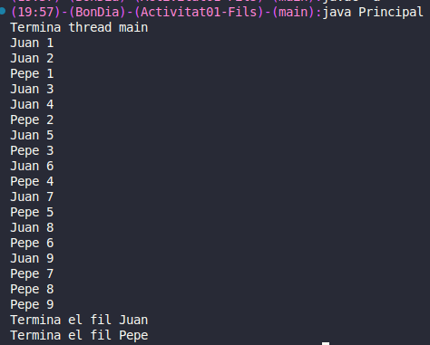
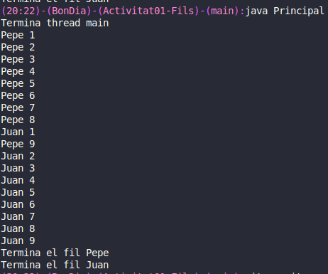
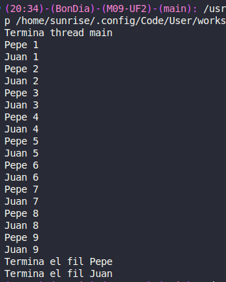

## ACTIVITAT01 FILS

### Exercici 1  Equitativament
En aquest exercici s'han de mostrar equitativament els resultats.
Principal.java:
```java
public class Principal{
	public static void main(String[] args){
		Fil fil1 = new Fil("Juan");
		Fil fil2 = new Fil("Pepe");
		fil1.start();
		fil2.start();
		System.out.println("Termina thread main");
	}
}
```

Fil.java:
```java
public class Fil extends Thread{
    String name;
    public Fil(String name){
        this.name = name;
    }
    @Override
    public void run() {
        for(int i = 1; i < 10; i++){
            System.out.println(name + " " + i);
        }
        System.out.println("Termina el fil " + name);
        
    }
}
```
Resultat:
Com es pot veure en la imatge, els prints són repartits equitativament entre els 2 fils.    


### Exercici 2 Primer un i després l'altre
En aquest exercici s'han de mostrar primer un i posteriorment l'altre.
Principal.java:
```java
public class Principal{
	public static void main(String[] args){
		Fil fil1 = new Fil("Juan");
		Fil fil2 = new Fil("Pepe");
		fil1.start();
		fil2.start();
		System.out.println("Termina thread main");
	}
}
```
Fil.java:
```java
public class Fil extends Thread{
    String name;
    public Fil(String name){
        this.name = name;
    }
    @Override
    public void run() {
        for(int i = 1; i < 10; i++){
            System.out.println(name + " " + i);
        }
        System.out.println("Termina el fil " + name);
        
    }
}
```
Resultat:
Com es pot veure en la imatge, els primers prints són majoritàriament d'un i després la resta de l'altre.


### Exercici 3 Intercalat
En aquest exercici s'han de mostrar intercalats.
Principal.java:
```java
public class Principal{
	public static void main(String[] args){
		Fil fil1 = new Fil("Juan");
		Fil fil2 = new Fil("Pepe");
		fil1.start();
		fil2.start();
		System.out.println("Termina thread main");
	}
}
```
Fil.java:
```java
public class Fil extends Thread{
    String name;
    public Fil(String name){
        this.name = name;
    }
    @Override
    public void run() {
        for(int i = 1; i < 10; i++){
            System.out.println(name + " " + i);
            try {
                Thread.sleep(10);
            } catch (InterruptedException e) {
                e.printStackTrace();
            }
        }
        System.out.println("Termina el fil " + name);
        
    }
}
```
Com es pot veure en la imatge, els prints són intercalats, un es mostra primer i l'altre després, i així van fent amb cada print.

